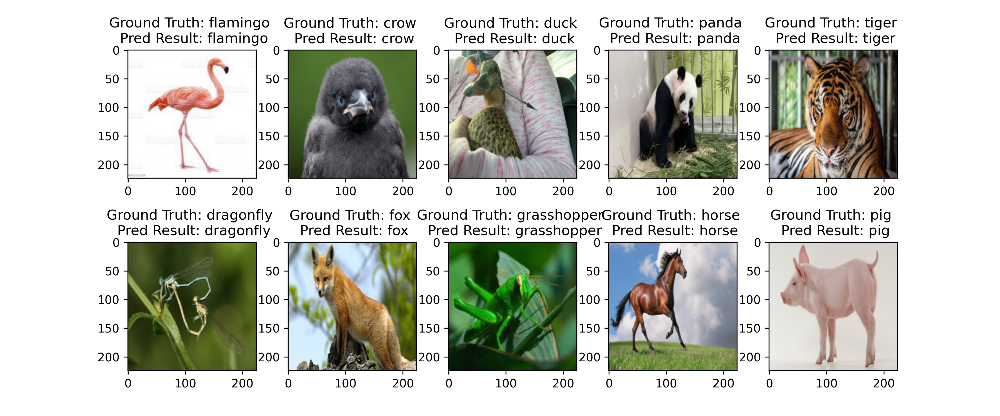

此部分主要为图像分类任务，以及其他任务的`backbone`

## 训练
```python
python train.py
```

## 推理
```python
python predict.py
```

## 结果展示





## 模型进度
- [x] [LeNet](backbone/alexnet.py)
- [x] [AlexNet](backbone/alexnet.py)
- [x] [VGG](backbone/vgg.py)  
- [x] [GoogleNet](backbone/googlenet.py)
- [x] [ResNet](backbone/resnet.py)
- [x] [MobileNet](classification/backbone/shufflenet.py)
- [ ] DenseNet

  ...
 
## 模型下载
- [LeNet-epoch100-cifar10](https://deepl-ckpt-classification.gd2.qingstor.com/lenet/lenet_cifar10_epoch_100.pth)
- ......